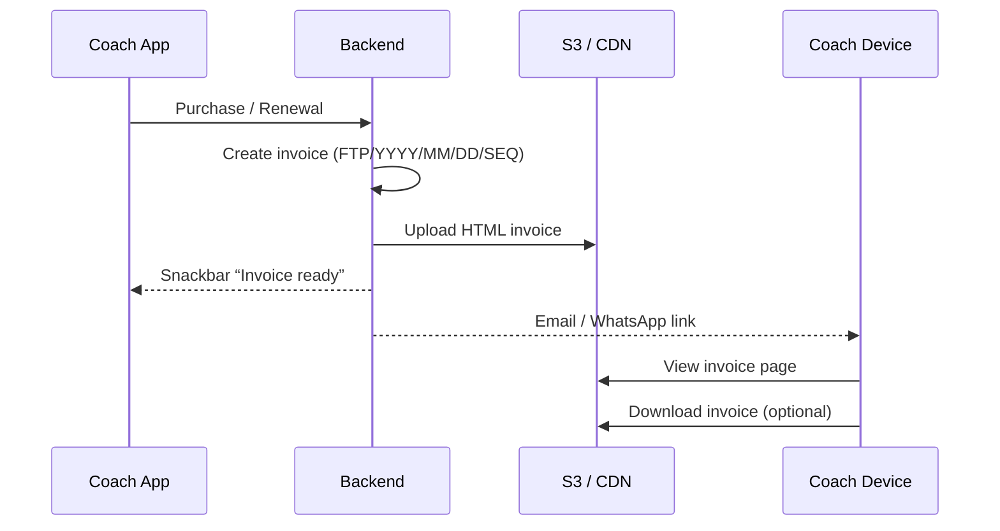

# Digital Subscription Invoice 

---

## 1.  Objective  
Issue every coach a **GST-compliant, paper-less** invoice for subscription purchases & renewals.  
Each invoice is delivered as

* a **responsive web page** (`/invoice/{slug}`)  
* a downloadable **PNG “invoice screenshot”** (lightweight, print-ready)  
* a **QR code** for instant verification or ledger lookup (Good to have not mandatory)
* an auto-number that encodes year, month, day and a monthly running sequence.

---

## 2.  Tax Logic  

| Billing State | Tax Applied | Rate |
|---------------|-------------|------|
| **Haryana** | CGST 9 % + SGST 9 % | 18 % |
| **Other Indian states** | IGST 18 % | 18 % |

Exactly **one** bucket (CGST/SGST *or* IGST) is non-zero per invoice.

---

## 3.  Invoice Numbering 

**Format:** `FTP/YYYY/MM/DD/SEQ`  

* `FTP` – static prefix  
* `YYYY` – four-digit year  
* `MM` – month (01-12)  
* `DD` – issue day  
* `SEQ` – **counter that resets on the 1st of each month**  

Example, 6 Apr 2025, third invoice that month → **`FTP/2025/04/6/3`**

### Generation (atomic)

```pseudo
today  = LocalDate.now()          # IST
prefix = "FTP/" + YYYY + "/" + MM + "/"

seq = get_next_sequence(prefix)   # 1,2,… resets monthly
invoice.number = prefix + DD + "/" + seq
```

---

## 4.  User Stories  

| ID | Role | Story | Acceptance |
|----|------|-------|------------|
| U1 | Coach | Need a clear digital invoice I can save/print. | Opens URL → sees invoice → downloads PNG |
| U2 | Finance | Require GST fields & correct monthly series number. | Number = `FTP/YYYY/MM/DD/SEQ`; GST shown |

---

## 5.  Functional Requirements  

### 5.1 Invoice Generation  
* Triggered on successful subscription purchase/renewal.  
* Captures coach details, plan, seats, discounts, tax, total.  
* **Number** generated as per 4 (monthly sequence).  
* Stores JSON → renders HTML → PNG.

### 5.2 Web Invoice Page  
* Sections: company header • bill-to block • item table • tax & total • QR • buttons **Download PNG / Print**  
* Mobile-first.

### 5.3 PNG Screenshot  
| Aspect | Spec |
|--------|------|
| Viewport | eg. 1440 × 2048 px (design will provide this) |
| Output | eg PNG, ≤ 350 kB |
| Storage | S3 / CDN (`image_url`) |

### 5.4 QR Code  (if generated)
Signed JWT payload `{invoice_id, coach_id, amount, status}` (90-day expiry) → `/verify/{token}` endpoint.

### 5.5 Delivery  
Email (HTML), WhatsApp template (opt-in), in-app.

### 5.6 Finance Exports / API  
Date-range CSV/JSON/ZIP(PNG); REST `GET /api/v1/invoices` this is needed for finance in admin panel.

---

## 6.  Data Model (gxample)

| Field | Type | Notes |
|-------|------|-------|
| `invoice_id` | UINT | PK |
| `number` | VARCHAR(32) | `FTP/YYYY/MM/DD/SEQ` *(SEQ resets monthly)* |
| `coach_id` | UINT | FK |
| `billing_state` | VARCHAR(2) | “HR”, “UP”… |
| `subtotal` | DEC(10,2) | ex-tax |
| `cgst`, `sgst`, `igst` | DEC(10,2) | Only one set non-zero |
| `total` | DEC(10,2) | payable |
| `status` | ENUM(Pending/Paid/Cancelled) |
| `issue_date`, `due_date` | DATE |
| `web_slug` | CHAR(32) | unguessable |
| `image_url` | VARCHAR | PNG key |

---

## 7.  System Flow  



---

## 8.  QA Checklist  

- Number follows `FTP/YYYY/MM/DD/SEQ`; `SEQ` resets on 1st of each month.  
- Haryana → CGST + SGST; others → IGST.  
- PNG ≤ 350 kB, 

