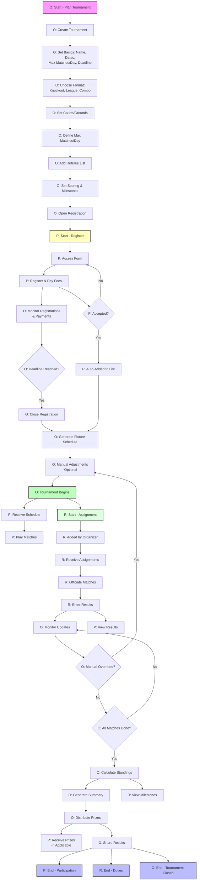

```mermaid
graph TD
    A[O: Start - Plan Tournament] --> B[O: Create Tournament]
    B --> C[O: Set Basics: Name, Dates,<br>Max Matches/Day, Deadline]
    C --> D[O: Choose Format:<br>Knockout, League, Combo]
    D --> E[O: Set Courts/Grounds]
    E --> F[O: Define Max Matches/Day]
    F --> G[O: Add Referee List]
    G --> H[O: Set Scoring & Milestones]
    H --> I[O: Open Registration]
    I --> J[P: Start - Register]
    J --> K[P: Access Form]
    K --> L[P: Register & Pay Fees]
    L --> M{P: Accepted?}
    M -->|Yes| N[P: Auto-Added to List]
    M -->|No| K
    L --> O[O: Monitor Registrations<br>& Payments]
    O --> P{O: Deadline Reached?}
    P -->|Yes| Q[O: Close Registration]
    Q --> R[O: Generate Fixture Schedule]
    R --> S[O: Manual Adjustments<br>-Optional]
    N --> R
    S --> T[O: Tournament Begins]
    T --> U[P: Receive Schedule]
    U --> V[P: Play Matches]
    T --> W[R: Start - Assignment]
    W --> X[R: Added by Organizer]
    X --> Y[R: Receive Assignments]
    Y --> Z[R: Officiate Matches]
    Z --> AA[R: Enter Results]
    AA --> BB[O: Monitor Updates]
    AA --> CC[P: View Results]
    BB --> DD{O: Manual Overrides?}
    DD -->|Yes| S
    DD -->|No| EE{O: All Matches Done?}
    EE -->|No| BB
    EE -->|Yes| FF[O: Calculate Standings]
    FF --> GG[O: Generate Summary]
    GG --> HH[O: Distribute Prizes]
    HH --> II[P: Receive Prizes<br>-If Applicable]
    FF --> JJ[R: View Milestones]
    HH --> KK[O: Share Results]
    KK --> LL[P: End - Participation]
    KK --> MM[R: End - Duties]
    KK --> NN[O: End - Tournament Closed]

    style A fill:#f9f,stroke:#333,stroke-width:2px
    style NN fill:#bbf,stroke:#333,stroke-width:2px
    style J fill:#ffb,stroke:#333,stroke-width:2px
    style LL fill:#bbf,stroke:#333,stroke-width:2px
    style W fill:#dfd,stroke:#333,stroke-width:2px
    style MM fill:#bbf,stroke:#333,stroke-width:2px
    style T fill:#bfb,stroke:#333,stroke-width:2px

```