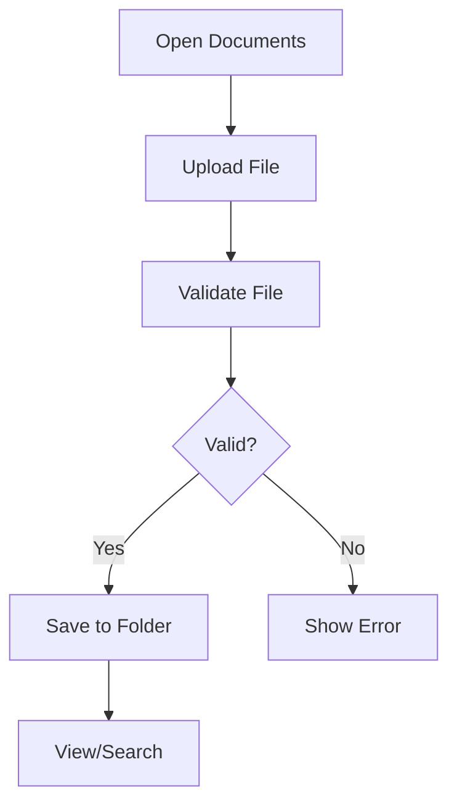
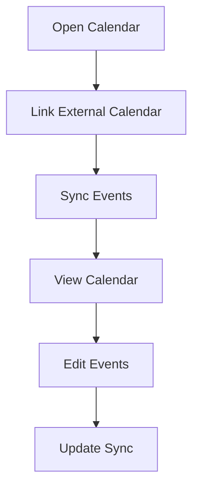
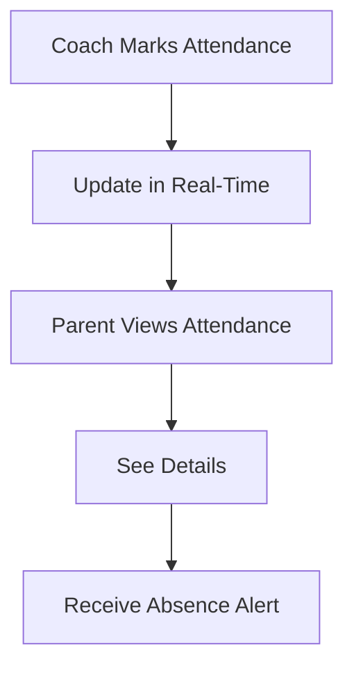

# 6. Additional Features

The Additional Features module enhances the app with tools for document management, scheduling, and attendance.

### 6.1 Document Management System
- **Purpose**: To organize and store coaching-related documents securely.
- **Detailed Functionality**:
    - **Documents**:
        - Contracts, medical forms, consent forms.
        - Training plans, session notes from coaches.
    - **Features**:
        - Upload (PDF, JPEG, max 10MB), download, share.
        - Organize into folders (e.g., “Medical,” “Training”).
        - Search by name or tags.
    - **Edge Cases**:
        - Handle corrupted files with validation.
        - Support bulk uploads (up to 5 files).

- **User Flow**:
    1. Parent opens “Documents” tab.
    2. Uploads or views documents.
    3. Organizes into folders or searches.

- **UI/UX Considerations**:
    - Folder-based UI with drag-and-drop.
    - File preview with zoom.
    - Search bar with tag filters.

**Summary Table**:

| Feature | Description | UI/UX Notes |
|---------|-------------|---------------------|
| Documents | Contracts, plans, forms | Folder-based UI |
| Features | Upload, organize, search | File preview, tag filters |
| Edge Cases | Corrupted files, bulk uploads | Drag-and-drop |

### 6.2 Calendar Integration
- **Purpose**: To sync coaching schedules with parents’ calendars.
- **Detailed Functionality**:
    - **Features**:
        - View sessions, events, deadlines in a monthly/weekly view.
        - Sync with Google Calendar, Outlook, Apple Calendar.
        - Reminders 1 hour before sessions.
    - **Customization**: Color-code events by child or sport.
    - **Edge Cases**:
        - Handle sync conflicts (e.g., duplicate events).
        - Support offline calendar access.
- **User Flow**:
    1. Parent opens “Calendar” tab.
    2. Links external calendar via OAuth.
    3. Views and manages events.
- **UI/UX Considerations**:
    - Calendar UI with day/week/month views.
    - Event pop-ups with edit options.
    - Sync toggle with status indicator.

**Summary Table**:

| Feature | Description | UI/UX Notes |
|---------|-------------|---------------------|
| Features | View, sync, reminders |  Day/week/month views |
| Customization | Color-code by child/sport | Event pop-ups |
| Edge Cases | Sync conflicts, offline | Sync status indicator |

### 6.3 Attendance Tracking
- **Purpose**: To monitor children’s session attendance.
- **Detailed Functionality**:
    - **Features**:
        - Real-time attendance marked by coaches.
        - Weekly/monthly reports with absence reasons.
        - Alerts for frequent absences (3+ in a month).
    - **Edge Cases**:
        - Handle disputed attendance with a resolution process.
        - Archive attendance data after 2 years.
- **User Flow**:
    1. Parent views attendance in “Progress” tab.
    2. Sees details (date, reason).
    3. Receives absence alerts.
- **UI/UX Considerations**:
    - Attendance calendar with green/red markers.
    - Report cards with summary stats.
    - Alert banners for absences.

**Summary Table**:

| Feature | Description | UI/UX Notes |
|---------|-------------|---------------------|
| Features | Real-time, reports, alerts | Attendance calendar |
| Reports | Weekly/monthly with reasons | Report cards |
| Edge Cases | Disputed attendance, archiving | Alert banners |
