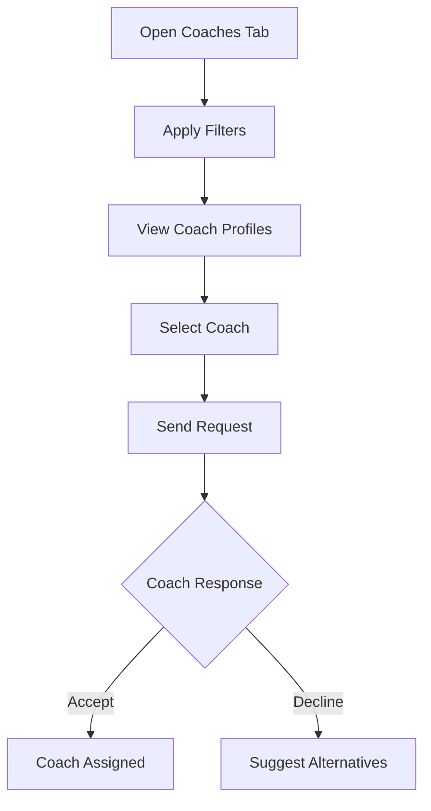
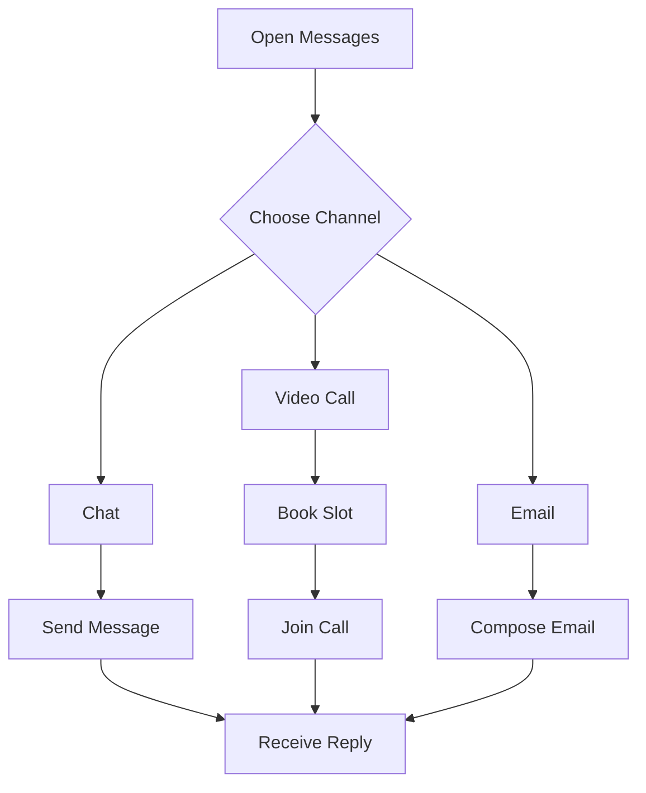
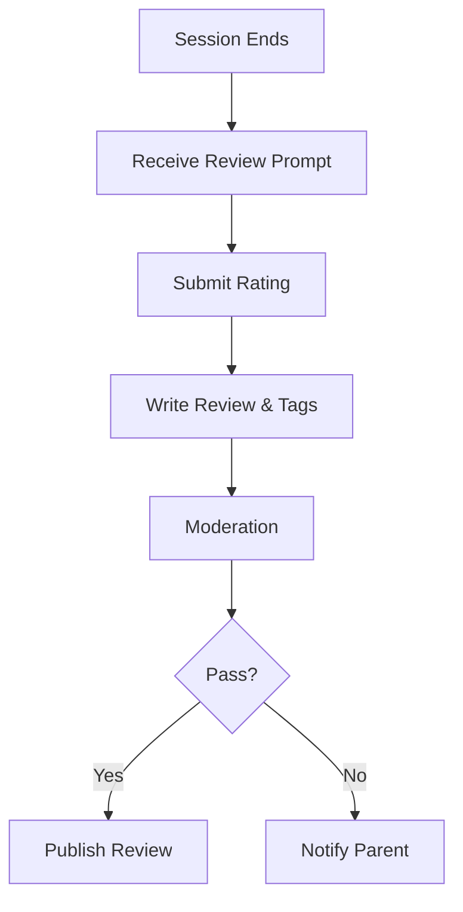

# 2. Coach Management

The Coach Management module enables parents to discover, communicate with, and evaluate coaches, fostering trust and collaboration.

### 2.1 Coach Profile Viewing and Selection
- **Purpose**: To help parents find and assign qualified coaches for their children.
- **Detailed Functionality**:
    - **Search and Filter**:
        - Filters: Sport, location (within 50 km), experience (1–20+ years), rating (1–5 stars), availability.
        - Sort: By rating, distance, or price.
    - **Profile Details**:
        - Name, photo, certifications (e.g., BCCI Level 1 for cricket).
        - Specializations (e.g., spin bowling, sprint training).
        - Session rates (e.g., ₹500/hour), availability calendar, and video introduction (max 1 minute).
    - **Selection Process**:
        - Parents send a request to the coach, including child’s profile and preferred schedule.
        - Coach accepts/declines within 48 hours, with auto-decline if no response.
    - **Edge Cases**:
        - If a coach is unavailable, suggest alternatives based on filters.
        - Handle multiple requests to the same coach with a queue system.
- **User Flow**:
    1. Parent navigates to “Coaches” tab and applies filters.
    2. Views coach profiles and selects “Request Coach.”
    3. Submits request with child’s details.
    4. Receives confirmation when coach accepts.
- **UI/UX Considerations**:
    - Grid view for coach profiles with photos and key info.
    - Filter bar with sticky positioning for easy access.
    - Coach availability shown as a mini-calendar.

**Summary Table**:

| Feature | Description | UI/UX Notes |
|---------|-------------|---------------------|
| Search & Filter | Sport, location, rating | Sticky filter bar |
| Profile Details | Certifications, rates, video | Grid view, mini-calendar |
| Selection | Request with 48-hour response | Confirmation notifications |

### 2.2 Communication Channels with Coaches
- **Purpose**: To facilitate seamless and secure communication between parents and coaches.
- **Detailed Functionality**:
    - **Chat**:
        - Real-time messaging with text, images (max 5MB), and voice notes (max 30 seconds).
        - Read receipts and typing indicators.
    - **Video Calls**:
        - Scheduled via coach’s availability, with 15/30/60-minute slots.
        - Supports screen sharing for discussing progress.
    - **Email**:
        - Formal communication for session summaries or contracts.
        - Templates for common messages (e.g., “Request Feedback”).
    - **Edge Cases**:
        - Offline messages are queued and sent when connectivity is restored.
        - Block inappropriate content (e.g., offensive images) using moderation APIs.
- **User Flow**:
    1. Parent opens “Messages” tab and selects a coach.
    2. Chooses chat, video call, or email.
    3. For video calls, books a slot and joins via in-app link.
- **UI/UX Considerations**:
    - Chat UI with threaded replies and media previews.
    - Video call interface with mute, camera toggle, and end-call buttons.
    - Email composer with rich text editor and templates.
- **Technical Specifications**:
    - **Backend**: WebSocket for chat, WebRTC for video calls.
    - **APIs**: POST /message, POST /call-schedule.
    - **Security**: End-to-end encryption (Signal Protocol).

**Summary Table**:

| Feature | Description | UI/UX Notes |
|---------|-------------|---------------------|
| Chat | Text, images, voice notes | Threaded replies, media previews |
| Video Calls | Scheduled, screen sharing | Mute/camera controls |
| Email | Formal communication, templates | Rich text editor |

### 2.3 Review and Rating System
- **Purpose**: To enable parents to provide feedback on coaches, enhancing transparency.
- **Detailed Functionality**:
    - **Rating**: 1–5 stars, prompted after sessions or monthly.
    - **Review**: Optional text (max 500 characters) with predefined tags (e.g., “Punctual,” “Knowledgeable”).
    - **Moderation**: Reviews are scanned for inappropriate content (e.g., profanity) before publishing.
    - **Edge Cases**:
        - Prevent multiple reviews for the same session.
        - Allow parents to edit reviews within 24 hours.
- **User Flow**:
    1. Parent receives a review prompt post-session.
    2. Submits rating, review, and tags.
    3. Review is published after moderation (within 12 hours).
- **UI/UX Considerations**:
    - Star-rating widget with hover effects.
    - Tag selection as clickable chips.
    - Feedback form with character counter.

**Summary Table**:

| Feature | Description | UI/UX Notes |
|---------|-------------|---------------------|
| Rating | 1–5 stars | Star-rating widget |
| Review | Text and tags | Character counter, chip tags |
| Moderation | Scan for inappropriate content | Publish status indicator |

---
