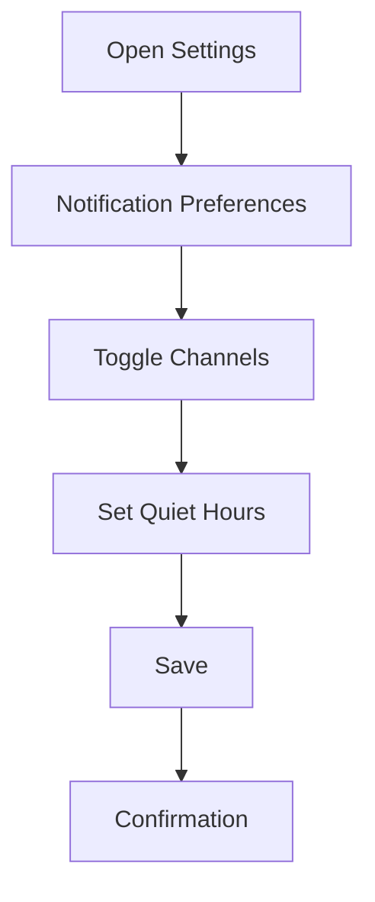
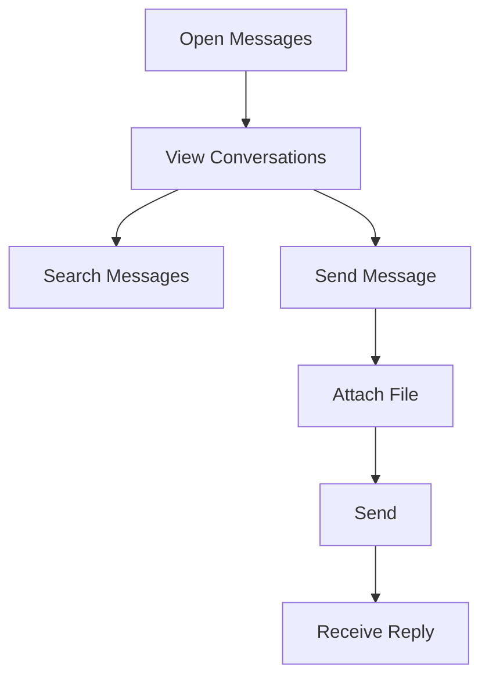
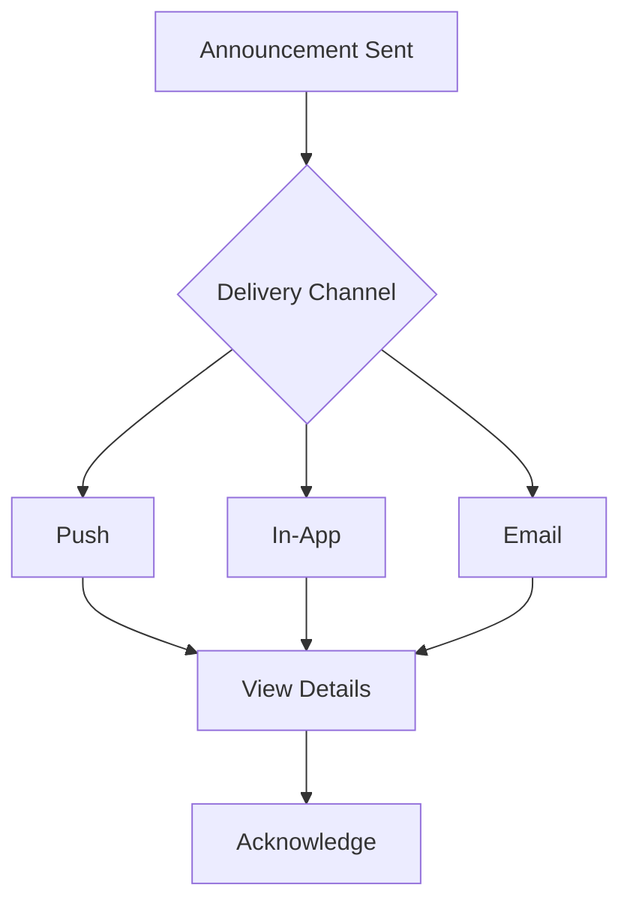

# 4. Communication Features

The Communication Features module ensures effective interaction between parents, coaches, and the platform.

### 4.1 Notification Preferences
- **Purpose**: To allow parents to customize notification delivery.
- **Detailed Functionality**:
    - **Channels**:
        - Push: Session reminders, achievement alerts.
        - Email/Whatsapp: Reports, invoices.
        - SMS/Whatsapp: Critical alerts (e.g., cancellations).
    - **Preferences**:
        - Enable/disable per channel.
        - Set quiet hours (e.g., no push notifications 10 PM–7 AM).
    - **Edge Cases**:
        - Handle undelivered notifications with retries.
        - Respect device-level notification settings.
- **User Flow**:
    1. Parent opens “Notification Settings.”
    2. Toggles channels and sets preferences.
    3. Saves with confirmation.
- **UI/UX Considerations**:
    - Toggle switches with channel previews.
    - Time picker for quiet hours.
    - In-app guide on notification types.

**Summary Table**:

| Feature | Description | UI/UX Notes |
|---------|-------------|---------------------|
| Channels | Push, email, SMS, whatsapp | Toggle switches |
| Preferences | Enable/disable, quiet hours | Time picker |
| Edge Cases | Undelivered, device settings |  Notification guide |

### 4.2 Message Center Requirements
- **Purpose**: To provide a centralized hub for all communications.
- **Detailed Functionality**:
    - **Features**:
        - Threaded conversations with coaches and support.
        - Search by keyword, date, or sender.
        - Attachments (images, PDFs, max 10MB).
    - **Notifications**: Real-time alerts for new messages.
    - **Edge Cases**:
        - Archive old threads (older than 6 months).
        - Handle large attachments with compression.
- **User Flow**:
    1. Parent opens “Messages” tab.
    2. Views conversations, sorted by recency.
    3. Sends/replies with text or attachments.
- **UI/UX Considerations**:
    - Chat UI with pinned threads.
    - Search bar with autocomplete.
    - Attachment preview with download option.

**Summary Table**:

| Feature | Description | UI/UX Notes |
|---------|-------------|---------------------|-------------|
| Conversations | Threaded, searchable | Pinned threads, search bar |
| Attachments | Images, PDFs, web | Preview, download option |
| Notifications | Real-time alerts | Autocomplete search |

### 4.3 Announcement Broadcasting
- **Purpose**: To keep parents informed of platform and coach updates.
- **Detailed Functionality**:
    - **Types**:
        - General: Platform updates, holidays.
        - Coach-Specific: Schedule changes, new programs.
    - **Delivery**: Push notifications, in-app feed, email.
    - **Engagement**: Acknowledge critical announcements (e.g., policy changes).
    - **Edge Cases**:
        - Expire announcements after 30 days unless pinned.
        - Handle mass delivery without overloading servers.
- **User Flow**:
    1. Parent receives announcement via push or feed.
    2. Views details in “Announcements” tab.
    3. Acknowledges if required.
- **UI/UX Considerations**:
    - Feed-style UI with expandable cards.
    - Priority badges for critical announcements.
    - Acknowledge button with confirmation.
- **Technical Specifications**:
    - **Backend**: Celery for scheduled delivery.
    - **APIs**: POST /announcement, GET /announcements.
    - **Tracking**: MongoDB for read receipts.

**Summary Table**:

| Feature | Description | UI/UX Notes |
|---------|-------------|---------------------|
| Types | General, coach-specific | Feed-style UI |
| Delivery | Push, in-app, email | Priority badges |
| Engagement | Acknowledge critical | Acknowledge button |

---
