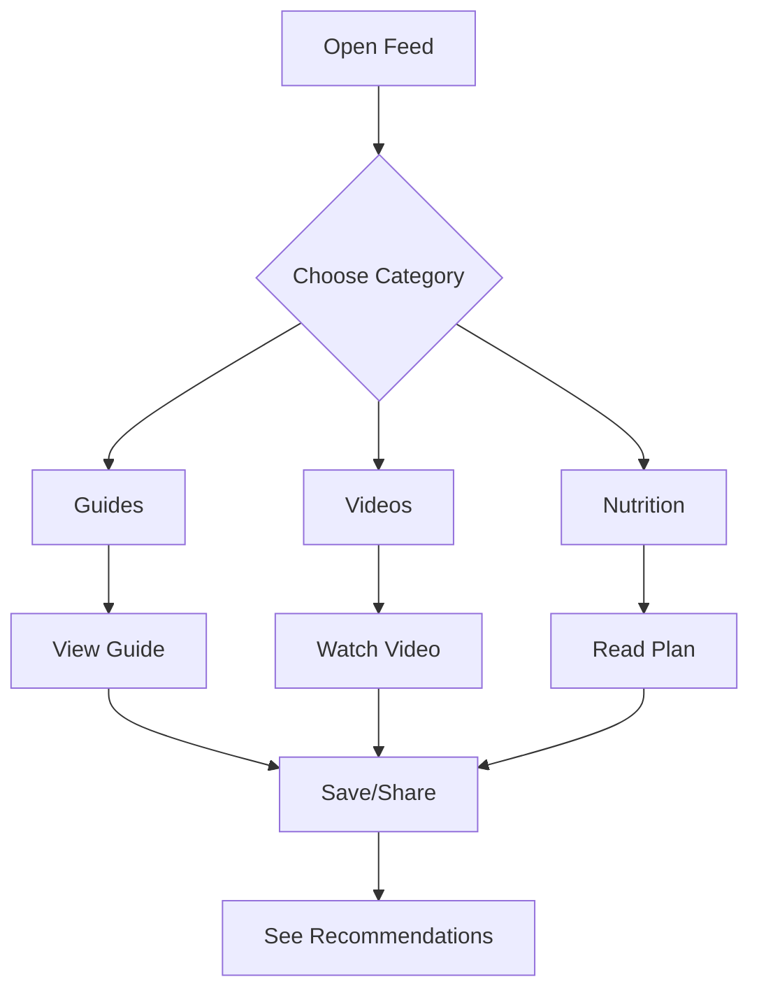

# 4. Feed with Guides and Videos

- **Purpose**: To provide educational content to support children’s coaching journey.
- **Detailed Functionality**:
    - **Content Types**:
        - **Guides**: Roadmaps from beginner to Olympic level (e.g., “Cricket Bowling Techniques,” “Swimming Stroke Progression”).
        - **Videos**: Tutorials, drills, motivational content (e.g., “How to Perfect Your Penalty Kick”).
        - **Nutrition Guides**: Age-specific meal plans, hydration tips, and recovery diets.
    - **Features**:
        - Browse by category (Guides, Videos, Nutrition).
        - Save to “Favorites” for offline access.
        - Share via WhatsApp, email, or social media.
        - AI-driven recommendations based on child’s sport and level. (long term)
    - **Interactivity**:
        - Guides include progress trackers (e.g., “Completed 3/10 drills”).
        - Nutrition guides offer printable meal planners.
    - **Edge Cases**:
        - Handle low-bandwidth scenarios with adaptive streaming.
        - Ensure content is age-appropriate (e.g., no advanced drills for beginners).
    - **User Flow**:
        1. Parent opens “Feed” tab.
        2. Filters by category or searches content.
        3. Views, saves, or shares content.
        4. Receives personalized recommendations.
- **UI/UX Considerations**:
    - Infinite scroll feed with card-based content.
    - Video player with playback controls and subtitle toggle.
    - Progress bars for guide completion.
    - Recommendation carousel at the top.

**Summary Table**:

| Feature | Description | UI/UX Notes |
|---------|-------------|---------------------|
| Content Types | Guides, videos, nutrition | Card-based feed |
| Features | Save, share, recommend | Video player, progress bars |
| Interactivity | Subtitles, trackers, planners | Subtitle toggle, printable plans |
| Edge Cases | Low bandwidth, age-appropriateness | Adaptive streaming |

---
