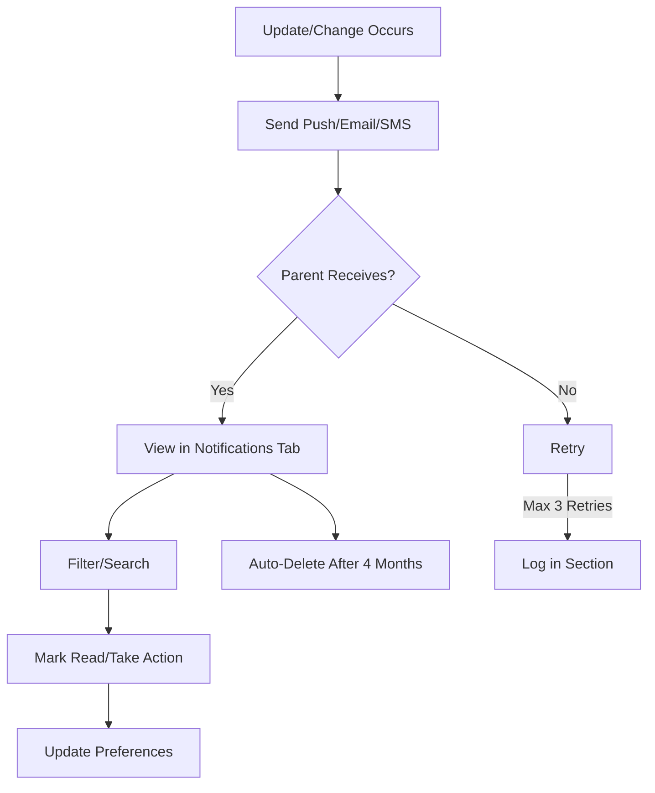

# 8. Push Notification Uses and Notification Section

The **Push Notification Uses and Notification Section** feature delivers push notifications for updates and changes only, with a 4-month lifespan, and provides an in-app notification hub for parents to manage communications.

### 8.1 Purpose
To communicate critical updates and changes (e.g., schedule changes, payment status) via push notifications, with a dedicated in-app section to review notifications, expiring after 4 months, supporting shared child profiles.

### 8.2 Detailed Functionality
- **Push Notification Uses**:
    - Limited to **updates and changes**:
		- **Schedule Changes**: Session rescheduling or cancellations (e.g., “Cricket session moved to 6 PM”).
		- **Payment Updates**: Confirmations, failures, or subscription renewals (e.g., “Payment of ₹500 successful”).
		- **Tournament Updates**: URL changes, cancellations, or status updates (e.g., “Tournament registration closed”).
		- **Privacy Changes**: Updates to child profile settings (e.g., “Medical data sharing disabled”).
		- **Approval Requests**: For secondary parents’ actions (e.g., payment initiation).
    - Excludes promotional or non-critical notifications (e.g., no achievement alerts).
- **Notification Section**:
    - Centralized hub in “Notifications” tab, showing push, email, and SMS notifications.
    - Features:
		- Filter by type (e.g., payments, tournaments), date, or child.
		- Search by keyword.
		- Mark as read/unread, archive.
		- Actionable notifications (e.g., “Approve Payment” button).
    - Categories: All, Unread, Action Required, Archived.
    - **Lifespan**: Notifications expire after 4 months, automatically archived and deleted.
- **Multiple Parents per Child**:
    - Notifications sent to all linked parents, with context (e.g., “Parent B updated schedule”).
    - Both parent receives approval requests and parents see status updates.
    - Shared notification history ensures transparency.
- **Integration with Coach App**:
	- Coaches trigger notifications (e.g., schedule changes) via Coach App, synced to Parents App.
- **Preferences**:
	- Customize channels (push, email, SMS) and quiet hours (e.g., no push 10 PM–7 AM).
	- Critical notifications (e.g., cancellations) bypass quiet hours.
- **Edge Cases**:
	- **Undelivered Notifications**: Retry up to 3 times; log in notification section.
	- **Expiration**: Auto-delete notifications after 4 months, with user confirmation for manual deletion.

### 8.3 User Flow
1. Update/change triggers push notification (e.g., “Session cancelled”).
2. Parent opens “Notifications” tab to view history.
3. Filters by type or child, marks as read, or takes action (e.g., approves request).
4. Updates preferences in settings.

### 8.4 UI/UX Considerations
- **Push Notifications**: Include child name and update (e.g., “Payment by Parent A successful”).
- **Notification Section**: List view with icons for type, timestamp, and action buttons.
- **Filters**: Sticky bar with type/child/date dropdowns.
- **Preferences**: Toggle switches for channels, time picker for quiet hours.

### 8.5 Summary Table

| Feature | Description | UI/UX Notes |
|---------|-------------|---------------------|
| Push Uses | Updates/changes only | Child-specific, actionable |
| Notification Section | Hub, 4-month lifespan | List view, action buttons |
| Multiple Parents | Shared notifications | Context-aware messages |
| Preferences | Channels, quiet hours | Toggles, time picker |

---