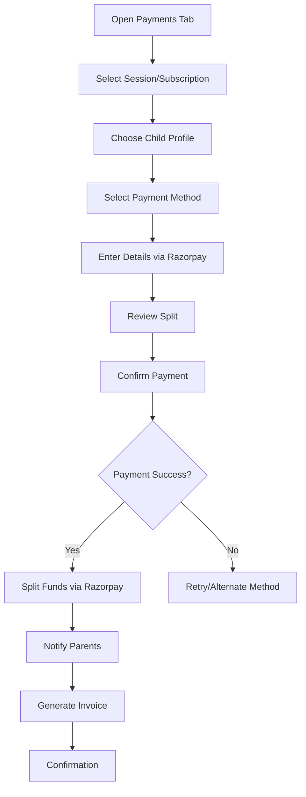

## 7. Payment (with Razorpay Route Payment) 
**Note**: this feature will mainly be for Academies at start, as we'll need to guide/help Academy to link there account to route accounts in razorpay for direct payment. we'll need to add something similar in coach onboarding flow for enabling this feature for coaches before launching it for coaches.

The **Payment** feature enables parents to pay coaching fees directly to academies/coaches, with a platform charge for FanToPark, using Razorpay Route for real-time fund splitting. Card saving and tokenization are excluded, relying on Razorpay’s payment service.

### 7.1 Purpose
To facilitate secure, direct payments to coaches for sessions/subscriptions, with FanToPark collecting a platform fee via Razorpay Route, supporting shared child profiles without storing card details.

### 7.2 Detailed Functionality
- **Payment Models**:
    - **Pay-Per-Session**: One-time payments (e.g., ₹500/hour).
    - **Subscription**: Monthly/quarterly plans (e.g., ₹2000/month), with auto-renewal and 3-day grace period.
- **Payment Methods**(Razorpay UI):
    - Credit/Debit Cards (Visa, Mastercard, RuPay).
    - UPI (Google Pay, PhonePe, Paytm etc).
    - Net Banking (SBI, HDFC, ICICI etc).

- **Razorpay Route Integration**:
    - **Fund Splitting**: Payments split in real-time:
    - Example
        - Coach: Coaching fee (e.g., 80% of ₹500 = ₹400).
        - FantoPark: Platform fee (e.g., 20% = ₹100 + 18% GST).
        - **Direct Transfer**: Coach’s portion routes to their RazorpayX-linked bank account (T+3 days settlement).
        - **Platform Fee**: Transparent display (e.g., “Platform Fee: ₹100 + ₹18 GST”).
        - **No Additional Charges**: No fees for SMS/email notifications.
        - **Settlement**: Platform fees settle in T+1 day.

- **No Card Saving/Tokenization**:
    - Parents enter payment details for each transaction via Razorpay’s secure checkout.
    - Razorpay handles payment security (PCI-DSS compliant, 3D Secure for cards).

- **Multiple Parents per Child**:
    - Any parent (primary/secondary) can initiate payments; only one payment is processed per session/subscription to prevent duplicates.
    - Both parent receives notifications for all payments; and parents see payment history.
    - Payment logs indicate paying parent (e.g., “Paid by Parent A”).

- **Integration with Coach App**:
    - Coaches receive payment confirmations and view transaction history.
    - Razorpay Route simplifies fund distribution for coaches.

- **Edge Cases**:
    - **Declined Payments**: Retry up to 3 times or suggest alternate methods.
    - **Duplicate Payments**: Prevented by locking payment status.

- **Invoices/Receipts**:
    - Generated post-payment (web, in-app, email).
    - Details: Session date, coach name, split amounts, transaction ID.

### 7.3 User Flow
1. Parent navigates to “Payments” tab and selects session/subscription.
2. Chooses child profile and payment method.
3. Enters payment details via Razorpay checkout.
4. Reviews split (coach fee + platform fee) and confirms payment.
5. Notifies all linked parents; receives invoice/receipt.

### 7.4 UI/UX Considerations
- **Payment Screen**: Breakdown of coach fee, platform fee, and total; Razorpay checkout embed.
- **Method Selector**: Icons for cards, UPI, net banking, wallets.
- **History View**: Filterable list with paying parent details.
- **Error Handling**: Clear messages for declined payments with retry options.
- **Accessibility**: High-contrast buttons, screen reader support.

### 7.5 Summary Table

| Feature | Description |  UI/UX Notes |
|---------|-------------|---------------------|
| Models | Pay-per-session, subscription | Clear fee breakdown |
| Razorpay Route | Real-time fund splitting | Transparent fees |
| No Card Saving | Razorpay checkout only | Embedded checkout |
| Multiple Parents | Shared payment history | Parent-specific logs |

