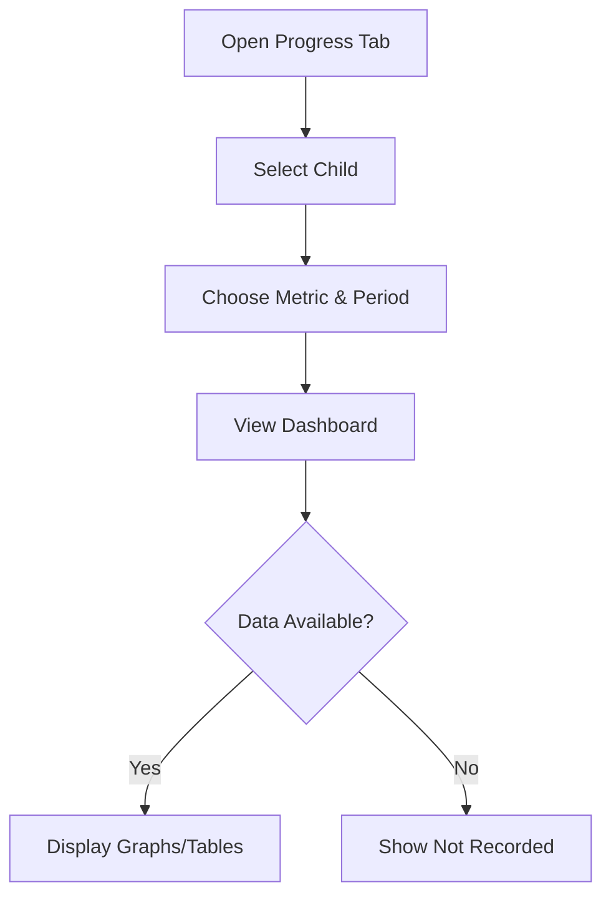
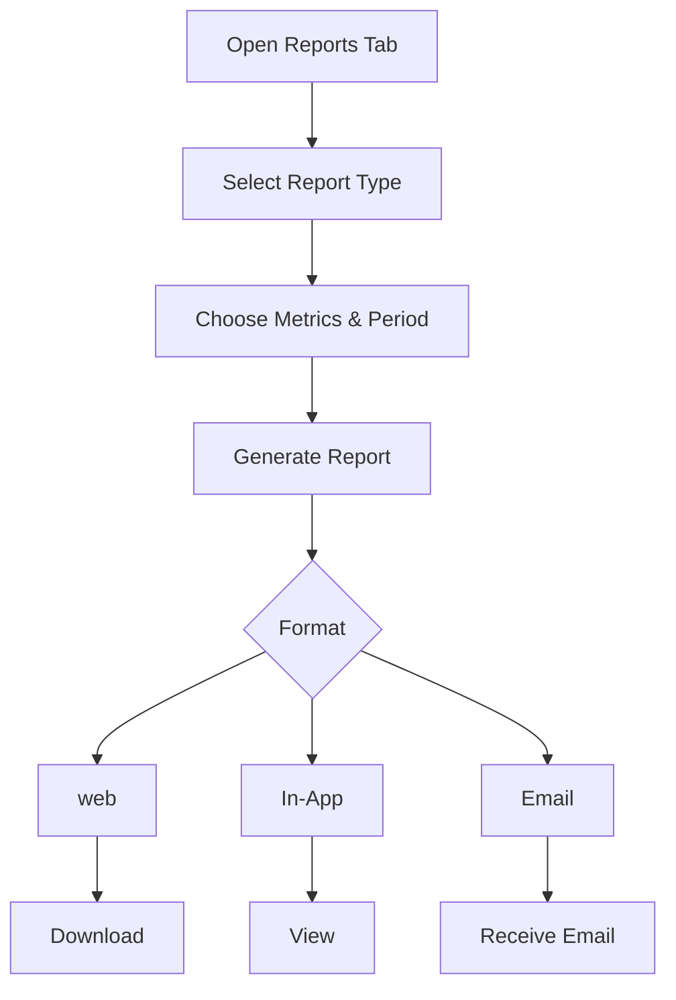
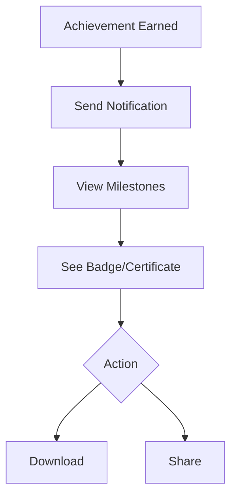

# 3. Performance Monitoring

The Performance Monitoring module provides parents with actionable insights into their child’s progress, fostering engagement and accountability.

### 3.1 Progress Tracking Metrics
- **Purpose**: To track and visualize sport-specific and general performance metrics.
- **Detailed Functionality**:
      - **Sport-Specific Metrics**:
          - Cricket: Batting average, bowling speed.
          - Football: Goal accuracy, dribbling success rate.
          - Swimming: Lap times, stroke efficiency.
      - **General Metrics**:
          - Attendance percentage.
          - Effort score (1–10, coach-rated).
          - Skill improvement (e.g., 20% increase in passing accuracy).
      - **Custom Metrics**: Coaches define additional metrics (e.g., “tackling success” for football).
      - **Visualization**: Line graphs for trends, bar charts for comparisons, tables for raw data.
      - **Edge Cases**:
          - Handle missing data by displaying “Not Recorded” with a coach notification.
          - Support metric updates by coaches within 48 hours of a session.
- **User Flow**:
      1. Parent opens “Progress” tab for a child.
      2. Selects metric type and time period (week, month, year).
      3. Views data in graphs or tables.
- **UI/UX Considerations**:
      - Interactive dashboard with zoomable graphs.
      - Filter dropdowns for metric type and time range.
      - Tooltips explaining each metric.

**Summary Table**:

| Feature | Description | UI/UX Notes |
|---------|-------------|---------------------|
| Metrics | Sport-specific, general, custom | Interactive graphs |
| Visualization | Line, bar, tables | Zoomable charts, tooltips |
| Data Handling | Missing data, updates | Filter dropdowns |

### 3.2 Report Formats and Frequency
- **Purpose**: To deliver summarized progress reports in user-friendly formats.
- **Detailed Functionality**:
    - **Formats**:
      - **PDF Reports**: Detailed with graphs, coach comments, and recommendations (10–15 pages).
      - **In-App Summaries**: Brief overviews with key metrics (1–2 screens).
      - **Email Digests**: Weekly/monthly highlights (500–1000 words).
    - **Frequency**:
      - Weekly: Attendance and effort summaries.
      - Monthly: Comprehensive skill progress reports.
      - On-Demand: Generated anytime via “Reports” tab.
    - **Customization**: Parents choose metrics to include and report style (e.g., detailed vs. concise).
    - **Edge Cases**:
      - Handle large datasets by paginating web reports.
      - Resend failed email deliveries after 1 hour.
- **User Flow**:
    1. Parent navigates to “Reports” tab.
    2. Selects report type, metrics, and period.
    3. Views or downloads report.
- **UI/UX Considerations**:
    - Preview pane for reports before download.
    - Customizable report templates (e.g., color themes).
    - Progress bar for report generation.

**Summary Table**:

| Feature | Description | UI/UX Notes |
|---------|-------------|---------------------|
| Formats | web, in-app, email | Preview pane |
| Frequency | Weekly, monthly, on-demand | Customizable templates |
| Customization | Metric selection, style| Progress bar |

### 3.3 Achievement and Milestone System
- **Purpose**: To motivate children by recognizing their accomplishments.
- **Detailed Functionality**:
    - **Achievements**:
      - **Skill-Based**: E.g., “Completed 50 serves” (tennis).
      - **Attendance-Based**: E.g., “Attended 20 sessions.”
      - **Custom**: Coach-defined (e.g., “First tournament win”).
    - **Rewards**: Digital badges, downloadable certificates, and in-app animations.
    - **Sharing**: Parents can share achievements on social media or via email/WhatsApp.
    - **Edge Cases**:
      - Prevent duplicate achievements for the same milestone.
      - Handle revoked achievements (e.g., if coach corrects data).
- **User Flow**:
    1. Child earns an achievement, triggering a notification.
    2. Parent views details in “Milestones” tab.
    3. Downloads certificate or shares achievement.

**Summary Table**:

| Feature | Description | UI/UX Notes |
|---------|-------------|---------------------|
| Achievements | Skill, attendance, custom | Animated badge unlock |
| Rewards | Badges, certificates | Certificate preview |
| Sharing | Social media, email  | Pre-filled sharing modal |

---
