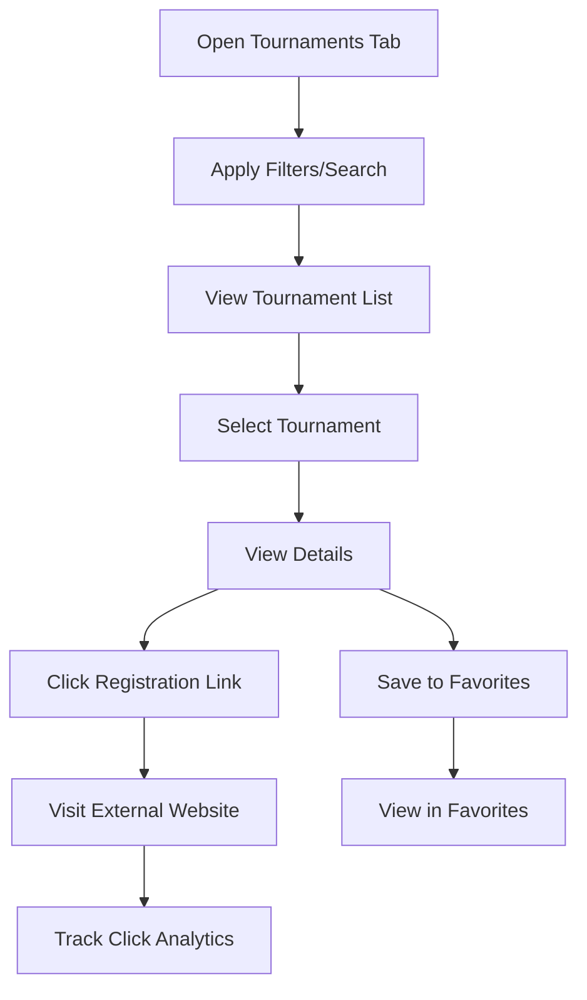

# 5. Tournament Guide

The **Tournament Guide** feature enables parents to discover upcoming sports tournaments in their city, with filtering by sport, age, and other criteria, and provides external registration links to the tournament’s official website, avoiding in-app registration.

### 5.1 Purpose
To offer a platform for parents to browse and filter sports tournaments, directing them to official websites for registration, enhancing accessibility to competitive opportunities while integrating with the Coach App.

### 5.2 Detailed Functionality
- **Tournament Discovery**:
    - Lists upcoming tournaments within a configurable radius (default: 100 km from parent’s city, adjustable via GPS or manual entry).
        - Data sourced from:
            - Coach App, where coaches/organizers post tournaments with registration URLs.
            - Verified third-party sports federations (e.g., BCCI, AIFF), ensuring valid links.
    - Tournament details include:
        - Name, date(s), location (with Google Maps link), sport, age group (e.g., U-10, U-15), skill level (beginner, intermediate, advanced).
        - Registration deadline, entry fee estimate, organizer contact, and **registration link** (URL to tournament’s website).
        - Optional: Video introduction (max 1 minute), prizes, spectator policies.
- **Filtering and Sorting**:
    - **Filters**:
        - **City**: Dropdown or map-based (e.g., Delhi, Mumbai).
        - **Sport**: Multi-select (e.g., cricket, football, swimming).
        - **Age Group**: Range slider or checkboxes (4–8, 9–12, etc.).
        - **Others**: Date range, skill level, estimated entry fee, gender (male, female, co-ed).
    - **Search**: Tournament name
    - **Sort**: By date, distance, entry fee.
- **Registration Process**:
    - Instead of in-app registration, parents click the provided **registration link** to access the tournament’s official website for registration.
    - The app tracks clicks on registration links for analytics (e.g., popular tournaments).
    - For shared child profiles, all parents (primary/secondary) can view and access links; no approval is needed since registration is external.
- **Integration with Coach App**:
    - Coaches post tournaments with registration URLs in the Coach App, syncing to the Parents App via webhooks.
    - Coaches can update URLs or mark tournaments as closed, triggering notifications.
- **Multiple Parents per Child**:
    - All linked parents can browse tournaments and access registration links.

### 5.3 User Flow
1. Parent navigates to “Tournaments” tab.
2. Applies filters (city, sport, age) or searches by keyword.
3. Browses tournament list and selects one for details.
4. Views registration link and clicks to visit tournament’s website.
5. Optionally saves tournament to “Favorites” for later access.

### 5.4 UI/UX Considerations
- **List View**: Card-based UI with tournament photo, name, date, sport, and age group.
- **Filter Bar**: Sticky, collapsible with clear/reset buttons and sport icons.
- **Details Page**: Tabbed (Overview, Rules, Registration) with prominent “Register Now” button linking to external site.
- **Map**: Google Maps embed with directions.
- **Favorites**: Heart icon to save tournaments, accessible in a dedicated tab.
- **Accessibility**: High-contrast text, screen reader support, multilingual filters.

### 5.6 Summary Table

| Feature | Description | UI/UX Notes |
|---------|-------------|---------------------|
| Discovery | List tournaments with URLs | Card-based UI, map embed |
| Filtering | City, sport, age, etc.  | Sticky filter bar, sliders |
| Registration | External website links | Prominent “Register Now” button |
| Multiple Parents | Shared access to links | Favorites tab, no approval needed |

