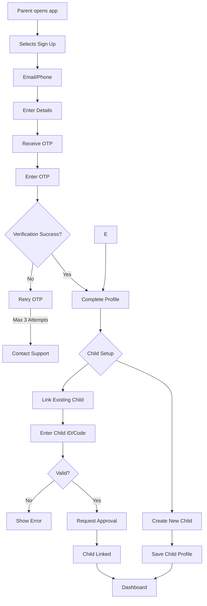
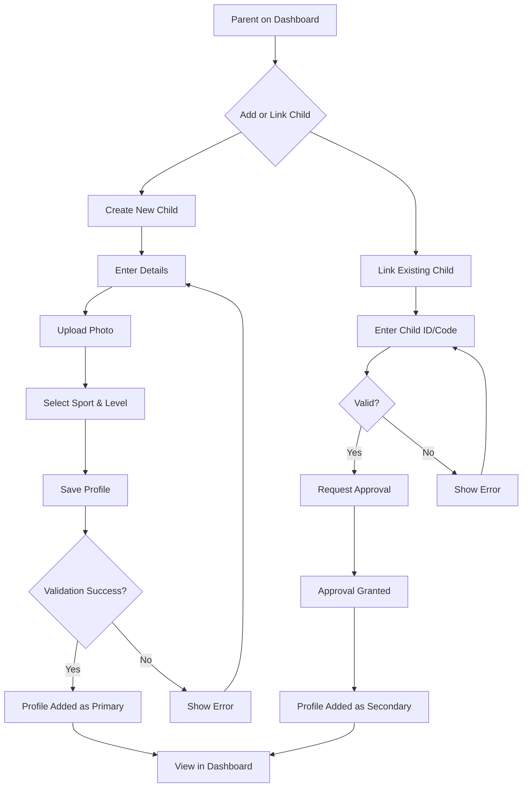
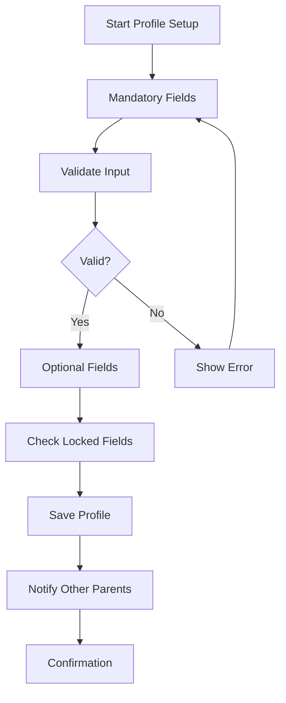
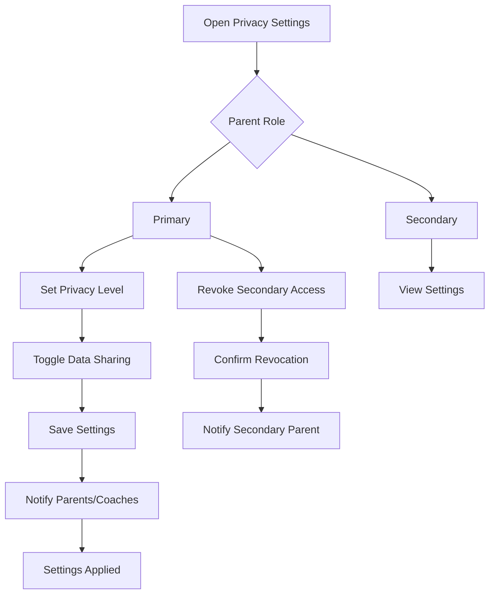

# 1. User Management & Profiles

The **User Management & Profiles** module is the cornerstone of the CoachDekho Parents App, enabling secure onboarding, flexible profile management, and granular privacy controls. With the new requirement, the module must support scenarios where multiple parents (e.g., mother, father, guardian) can link to and manage the same child’s profile, ensuring seamless coordination and data consistency. This module integrates with the existing Coach App, where coaches already interact with child profiles, requiring synchronized data and access control.

### 1.1 Parent Account Creation and Verification Process
- **Purpose**: To securely onboard parents, allowing them to create accounts and verify their identity, with provisions for linking to existing child profiles managed by other parents or coaches.
- **Detailed Functionality**:
    - **Sign-Up Options**: Parents can sign up using phone number, to streamline onboarding.
    - **Verification**: A 6-digit OTP is sent via SMS (for phone) or email, valid for 5 minutes, with up to 3 resend attempts.
    - **Profile Setup**: Parents provide mandatory details (full name, contact number) and optional details (address, profile picture, preferred language: English, Hindi, Tamil, etc.).
    - **Child Linking Option**: During or post-sign-up, parents can:
        - Create a new child profile.
        - Link to an existing child profile (created by another parent or coach) using a unique **Child ID** or an invitation code shared by another parent or coach.
    - **Security Features**:
        - Passwords: Minimum 8 characters, requiring uppercase, lowercase, numbers, and special characters.
        - Optional 2FA: Via authenticator apps (Google Authenticator, Authy) or SMS.
        - Account Lockout: After 5 failed login attempts, requiring a password reset.
    - **Multiple Parents per Child**:
        - When linking to an existing child, the parent must verify their relationship via an invitation code or approval from the primary parent/coach.
        - Each parent has independent access to the child’s profile but shares the same child data (e.g., performance metrics, attendance).
        - Conflict Resolution: If parents attempt conflicting actions (e.g., scheduling sessions), the system prioritizes the primary parent or requires consensus (via in-app voting or coach mediation).
    - **Edge Cases**:
        - **Duplicate Accounts**: Prevented by checking email/phone uniqueness.
        - **Invalid Child ID**: Display an error with a “Contact Support” option.
        - **Multiple Invitations**: Allow parents to accept multiple child invitations (e.g., for different children).
        - **Revoked Access**: If a parent’s access to a child is revoked (e.g., by the primary parent), notify them with a reason and appeal option.
- **User Flow**:
    1. Parent selects “Sign Up” from the landing screen.
    2. Enters email/phone and password or uses social login.
    3. Verifies identity via OTP.
    4. Completes profile setup with mandatory/optional fields.
    5. Chooses to create a new child profile or link to an existing one using Child ID/invitation code.
    6. If linking, verifies relationship (e.g., enters code or awaits approval).
    7. Lands on the dashboard with a welcome tutorial and linked child profiles.
- **UI/UX Considerations**:
    - **Sign-Up Form**: Minimal, with real-time validation (e.g., password strength meter).
    - **Child Linking**: Dedicated screen with “Create Child” or “Link Child” buttons, including a QR code scanner for invitation codes.
    - **Progress Bar**: Visualizes steps (Sign-Up → Verify → Profile → Child Setup).
    - **Accessibility**: High-contrast text, screen reader support, and multilingual prompts.
    - **Notifications**: In-app toast for successful linking or approval pending.

**Summary Table**:

| Feature | Description  | UI/UX Notes |
|---------|-------------|-------------|
| Sign-Up | phone  | Minimal form, progress bar |
| Verification | 6-digit OTP via SMS | Real-time OTP validation |
| Profile Setup | Mandatory/optional fields | Accessible, multilingual |
| Child Linking | Link to existing child via ID/code | QR code scanner, approval flow |
| Security | Password rules, 2FA, lockout | Password strength meter |

### 1.2 Adding Multiple Children Profiles
- **Purpose**: To allow parents to create or link to multiple child profiles, with support for shared child profiles across multiple parents, integrating with the Coach App.
- **Detailed Functionality**:
    - **Profile Creation**:
        - Parents can create new child profiles with details: name, age (4–18 years), gender, and optional fields (height, weight, medical conditions, allergies).
        - Assign a unique **Child ID** (e.g., UUID) to each child, shareable with other parents.
    - **Linking Existing Child**:
        - Parents can link to a child profile created by another parent or coach using the Child ID or an invitation code.
        - Verification: Requires approval from the primary parent (first parent to create/link the child) or coach, sent via in-app notification or email.
        - Role Assignment: Parents are assigned as “primary” (first parent) or “secondary” (additional parents), with primary parents having elevated permissions (e.g., revoking access).
    - **Sport Selection**: Choose sport(s) (e.g., cricket, football, swimming) and coaching level (beginner, intermediate, advanced), synced with the Coach App.
    - **Customization**:
        - Profile pictures (JPEG/PNG, max 5MB).
        - Nicknames and color-coded themes for easy identification.
    - **Management**:
        - Edit, delete, or archive child profiles. Archived profiles are recoverable for 90 days.
        - Primary parent can revoke secondary parents’ access, with a 7-day appeal window.
    - **Multiple Parents per Child**:
        - Child profiles are shared across linked parents, with real-time updates (e.g., performance metrics updated by coaches).
        - Access Control: Secondary parents have view/edit permissions, but only primary parents can manage parent linkages.
        - Conflict Resolution: For conflicting updates (e.g., changing medical info), the system logs changes and notifies all linked parents, with coach mediation if needed.
    - **Edge Cases**:
        - **Duplicate Profiles**: Prevented by cross-checking Child ID and name/age.
        - **Invalid Age**: Display error for ages outside 4–18.
        - **Revoked Access**: Notify secondary parents and provide appeal process.
        - **Coach App Sync**: Ensure coaches see all linked parents and their roles.
- **User Flow**:
    1. From the dashboard, parent selects “Add Child” or “Link Child.”
    2. For new child: Enters details, uploads photo, selects sport/level, and saves.
    3. For existing child: Enters Child ID/code, requests approval, and awaits confirmation.
    4. Child profile appears in the dashboard, with role (primary/secondary) indicated.
- **UI/UX Considerations**:
    - **Child List**: Card-based UI with photo, name, sport badges, and role tag (primary/secondary).
    - **Forms**: Collapsible sections for medical info, with validation prompts.
    - **Linking Flow**: QR code scanner or manual code entry, with status tracker (e.g., “Pending Approval”).
    - **Notifications**: In-app alerts for approval, revocation, or conflicts.

**Summary Table**:

| Feature | Description | UI/UX Notes |
|---------|-------------|---------------------|
| Profile Creation | New child with details | Collapsible forms, validation |
| Linking Child | Use Child ID/code | QR scanner, status tracker |
| Sport Selection | Sport and level | Dropdown with sport icons |
| Management | Edit/archive, revoke access | Role tags, conflict alerts |

### 1.3 Profile Information Requirements
- **Purpose**: To collect necessary and optional data for parent and child profiles, ensuring consistency across multiple parents and Coach App integration.
- **Detailed Functionality**:
    - **Parent Profile**:
        - **Mandatory**: Full name, email/phone.
        - **Optional**: Address, emergency contact, profile picture, preferred language.
    - **Child Profile**:
        - **Mandatory**: Name, age (4–18), gender.
        - **Optional**: Height, weight, medical history, dietary preferences, profile picture.
    - **Data Validation**:
        - Email: Valid format (e.g., user@domain.com).
        - Phone: Country-specific (e.g., +91 for India).
        - Age: Validated via date of birth.
    - **Multiple Parents per Child**:
        - Child data is centralized in a single document, accessible by all linked parents.
        - Updates by one parent (e.g., medical history) are synced instantly, with change logs visible to all parents.
        - Primary parent can lock sensitive fields (e.g., medical history) to prevent secondary parent edits.
    - **Edge Cases**:
        - **Incomplete Data**: Save partial data and prompt completion later.
        - **Multilingual Names**: Support Hindi, Tamil, etc., with Unicode encoding.
        - **Conflicting Updates**: Notify all parents and involve coach if unresolved.
        - **Coach App Sync**: Ensure coaches see the latest child data, with parent roles indicated.
- **User Flow**:
    1. During sign-up or child creation/linking, parent enters mandatory fields.
    2. Optional fields are presented with a “Skip” option.
    3. Updates are saved, with notifications to other linked parents.
    4. Primary parent can lock/unlock fields via settings.
- **UI/UX Considerations**:
    - **Stepper UI**: Separate mandatory and optional fields.
    - **Change Logs**: Timeline view of updates (e.g., “Medical history updated by Parent A”).
    - **Locked Fields**: Visual indicators (e.g., padlock icon) for restricted fields.
    - **Multilingual Support**: Dynamic keyboard switching.

**Summary Table**:

| Feature | Description | UI/UX Notes |
|---------|-------------|---------------------|
| Parent Fields | Name, email/phone | Stepper UI, inline errors |
| Child Fields | Name, age, gender, optional | Collapsible sections, skip option |
| Multiple Parents | Centralized data, change logs | Change timeline, locked fields |
| Validation | Email, phone, age | Multilingual support |

### 1.4 Privacy and Data Sharing Preferences
- **Purpose**: To give parents control over data sharing, with additional considerations for multiple parents sharing a child profile, ensuring alignment with Coach App access.
- **Detailed Functionality**:
    - **Privacy Levels**:
        - **Public**: Share child’s name, age, sport with all coaches.
        - **Private**: Share only with assigned coaches.
        - **Anonymous**: Share performance data without identifiers.
    - **Granular Controls**:
        - Toggle sharing for specific data (e.g., medical history, contact details).
        - Primary parent sets default sharing preferences for the child, which secondary parents can view but not edit.
    - **Multiple Parents per Child**:
        - **Shared Privacy Settings**: All parents see the same privacy settings, managed by the primary parent.
        - **Notifications**: Changes to privacy settings notify all linked parents and assigned coaches.
        - **Access Revocation**: Primary parent can revoke a secondary parent’s access, which removes their ability to view/edit child data.
    - **Consent Management**:
        - Explicit consent for data sharing, with reminders every 6 months.
        - Secondary parents must agree to the primary parent’s settings upon linking.
    - **Edge Cases**:
        - **Revoked Access**: Notify secondary parents with an appeal process.
        - **Data Deletion**: GDPR-compliant deletion requests (30-day processing) remove child data from all parent accounts.
        - **Coach App Integration**: Coaches only access data per the child’s privacy settings, regardless of parent roles.
    - **User Flow**:
        1. Parent navigates to “Privacy Settings” in the profile menu.
        2. Primary parent sets privacy level and toggles data sharing; secondary parents view settings.
        3. Changes are saved, with notifications to all linked parents and coaches.
        4. Primary parent can revoke secondary parent access via a dedicated option.
- **UI/UX Considerations**:
    - **Toggle Switches**: For data sharing, with tooltips explaining impact.
    - **Role-Based UI**: Primary parents see edit controls; secondary parents see read-only settings.
    - **Revocation Flow**: Confirmation modal with reason input for revoking access.
    - **Privacy Guide**: In-app tutorial on managing shared profiles.

**Summary Table**:

| Feature | Description |  UI/UX Notes |
|---------|-------------|---------------------|
| Privacy Levels | Public, private, anonymous | Toggle switches, tooltips |
| Granular Controls | Toggle specific data | Role-based UI |
| Multiple Parents | Shared settings, primary control | Read-only for secondary |
| Revocation | Remove secondary access | Confirmation modal, appeal |

-

## UI/UX Design Implications
- **Dashboard**: Display child profiles with parent roles and linked parent names (e.g., “Managed by Parent A, Parent B”).
- **Notifications**: Highlight shared profile actions (e.g., “Parent B updated medical history”).
- **Consistency**: Align UI elements (e.g., child cards, privacy settings) with Coach App for a cohesive experience.
