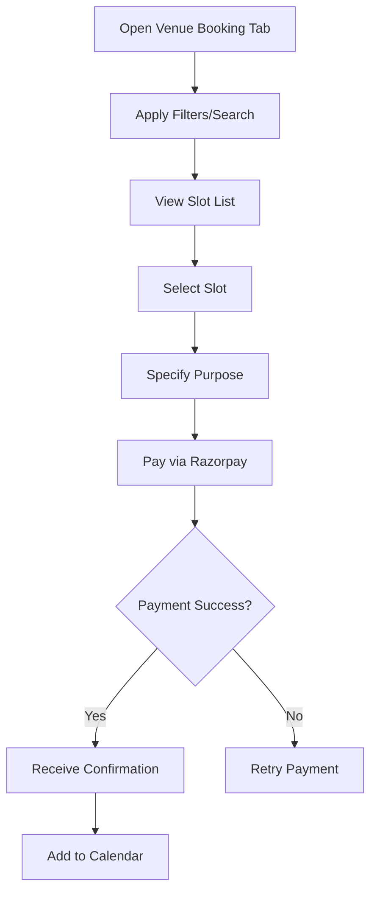

# 10. Parent-Side Venue Booking (Fantopark Parents App)

The **Parent-Side Venue Booking** feature allows users (parents, individuals, or groups, not limited to students) to browse, book, and receive confirmations for court or ground slots, integrating with academy-managed slots.

### 10.1 Purpose
To enable users to book courts or grounds for recreational or competitive use, pay via Razorpay Route (no card saving), and receive confirmations.

### 10.2 Detailed Functionality
- **Slot Browsing**:
    - Displays available slots for courts/grounds, synced from Coach App, filterable by:
        - **City**: Dropdown or map-based (e.g., Delhi, Mumbai).
        - **Venue Type**: Multi-select (e.g., cricket pitch, football field, badminton court).
        - **Date/Time**: Calendar view or range picker.
        - **Price**: Range slider (e.g., ₹500–₹5000).
        - **Restrictions**: Filter by usage (e.g., “Open to all,” “Teams only”).
    - Search by keyword (e.g., “badminton court Delhi”).
    - Sort by date, price, or distance.
- **Slot Details**:
    - Venue name, location (Google Maps link), type, date, time, duration, capacity (e.g., “2 spots left”), price (including platform fee), and restrictions.
- **Booking Process**:
    - Users select a slot and specify purpose (e.g., “Family game,” “Team practice”). Prefill (recreational activity)    
    - Payment via Razorpay Route (no card saving):
        - Users enter details in Razorpay checkout.
        - Funds split: academy (e.g., ₹1000), Fantopark (e.g., ₹236 with GST).
    - Confirmation via push notification (updates/changes, 4-month lifespan), email, and in-app receipt.
    - Booking adds to app’s calendar.
- **Integration with Coach App**:
    - Bookings sync to Coach App in real-time.
    - Academies receive booking notifications and user details.
- **Edge Cases**:
    - **Fully Booked**: Display “No Spots Available” with waitlist option.
    - **Cancellations**: Free 24+ hours before; 50% charge within 24 hours; refunds in 5–7 days.
    - **Payment Failures**: Retry up to 3 times or suggest alternate methods.    
- **Compliance**:
    - Setup Transparent pricing and refund policies.

### 10.3 User Flow
1. User navigates to “Venue Booking” tab.
2. Applies filters (city, venue type, date) or searches.
3. Selects slot and specifies purpose (individual/group).
4. Pays via Razorpay checkout.
5. Receives confirmation, notification, and calendar entry.

### 10.4 UI/UX Considerations
- **Slot List**: Card-based UI with venue photo, type, date, and capacity.
- **Filter Bar**: Sticky, collapsible with venue type icons and calendar picker.
- **Booking Screen**: Purpose dropdown and “Pay Now” button.

### 10.5 Summary Table

| Feature | Description | UI/UX Notes |
|---------|-------------|---------------------|
| Browsing | Filter court/ground slots |  Card-based UI, filter bar |
| Booking | Book for any purpose, pay via Razorpay | Purpose dropdown, approval modal |
| Multiple Parents | Primary approval for child bookings | Status tracker, notifications |
| Confirmation | Notification, calendar entry | Receipt view, calendar integration |

---

